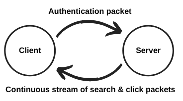

# **Flightmate AI-Stream Documentation**

## **Changes**

This version of the AI-stream is rewritten from Python to Golang to be able to handle heavier loads. 

The server now uses [Protobuf](https://www.wikiwand.com/en/Protocol_Buffers) for faster communication, but the client can convert it into JSON (e.g. by using the optional parameter `--print_json=true`). You can also print exclusively JSON to stdout by using the flag `--stdout=true`. 

We have also upgraded to using TLS instead of SSL, and (at least temporarily) use port 444 instead of 443. 

## **Installation instructions**

If you want to run by cloning the repo (`git clone -b Flightmate-Stream-2022 --single-branch https://github.com/Flightmate/Flightmate-Stream/`):
- Install Golang [here](https://go.dev/doc/install) 
- Run with `go run client.go --token=YOUR_TOKEN_HERE` 
- You can also edit `token = "INSERT YOUR TOKEN HERE` directly in client.go 

If you use the downloaded binaries (found under [Releases](/releases/latest)). (Note that you might get a "possible virus" warning, because we haven't bought an app certificate yet. This will be fixed in later versions): 
- Navigate to the file's location
- You might have to run chmod +x [filename] to change permissions 
- Run `./filename --token=YOUR_TOKEN_HERE` 

You can build the files yourself using: 
- env GOOS=windows  GOARCH=386 go build -o executables/streamclient-windows-386.exe client.go
- env GOOS=windows  GOARCH=amd64 go build -o executables/streamclient-windows.exe client.go
- env GOOS=darwin GOARCH=386 go build -o executables/streamclient-macOS-386 client.go
- env GOOS=darwin GOARCH=amd64 go build -o executables/streamclient-macOS client.go
- env GOOS=linux GOARCH=386 go build -o executables/streamclient-linux-386 client.go
- env GOOS=linux GOARCH=amd64 go build -o executables/streamclient-linux client.go

## **System description**

Flightmate AI-Stream is a stream of data containing all results displayed to the users in the result list at flygresor.se. The stream can be tapped into and the data can be stored in the customer's AI or BI systems to analyse the results and use it to improve content or pricing in their API responses to flygresor.se. The customer's results will be identified with a customer name code and the other customer's names will be anonymized in the stream.

To access the data stream an authentication is required. This will allow you access to the datastream and unmask the OTA signatures your allowed to see. If an authentication packet is malformed or does not match the server will drop the client. The authentication packet is a character sequence of 128 bytes and is supplied by Flightmate to the OTA. Please contact Valdemar at valle@flygresor.se for this.

## **Server information**

<table>
  <tr>
    <td>Hostname</td>
    <td>ai-stream.flightmate.com</td>
  </tr>
  <tr>
    <td>Port</td>
    <td>444</td>
  </tr>
  <tr>
    <td>Protocol</td>
    <td>TCP</td>
  </tr>
  <tr>
    <td>Encryption</td>
    <td>TLS</td>
  </tr>
</table>

## **Packet information shorthand**

<table>
  <tr>
    <td>Byte order</td>
    <td>Big endian</td>
  </tr>
  <tr>
    <td>Encoding</td>
    <td>UTF-8</td>
  </tr>
  <tr>
    <td>Header size</td>
    <td>9 bytes</td>
  </tr>
  <tr>
    <td>Header types</td>
    <td>[Unsigned long (4 bytes), unsigned long (4 bytes), unsigned char(1 byte)]</td>
  </tr>
  <tr>
    <td>Header content</td>
    <td>[Checksum, body size, packet type]</td>
  </tr>
    <tr>
    <td>Body size</td>
    <td>Byte length of Protobuf/JSON message</td>
  </tr>
  <tr>
    <td>Packet type 1</td>
    <td>Message with search data</td>
  </tr>
  <tr>
    <td>Packet type 2</td>
    <td>Message with click out data</td>
  </tr>
  <tr>
    <td>Packet type 3</td>
    <td>Authentication package with the OTA's 128 byte token requesting Protobuf</td>
  </tr>
    <td>Packet type 6</td>
    <td>Authentication package with the OTA's 128 byte token requesting JSON data</td>
  </tr>
</table>

## **Continuous stream of data packets**

The first 9 bytes of each package contains the package header. This header contains information the length of the package body, the package type and a checksum to verify the package’s integrity. It’s constructed like this: 

[(int) checksum (4 bytes), (int) body size (4 bytes), (int) packet type (1 byte)]

The checksum is made from the whole packet so to verify it you need to first unpack the header then pack it down without the checksum like this:

[(int) body size (4 bytes), (int) packet type (1 byte)]

Then you can verify the package with the checksum using the crc32 algorithm. We use Golang's unsigned checksums with the aviation polynomial `0xD5828281`. 

There are two types of packets you can receive from the stream. Packet type 1 contains search results showed to the user, and packet type 2 contains information about when a user clicks out on a trip and gets transferred to a OTA. 

### Search packet:

The search packets are sent each time a user display a search result (this includes users opening results from top-list and last minute). This also triggers when users apply filters or scroll to load in more results on the page, but the ShowresultId then stays consistent. They contain the following data:

**to:** The IATA code of the airport the flight is arriving to.

**from:** The IATA code of the airport the flight is departing from.

**leaveDate:** The date of the flight leaving the departure location.

**homeDate:** The date of departure for the return flight.

**childrenAges:** The ages of the children specified by the user when the search is made.

**youthAges:** The ages of the youths (12-25) specified by the user when the search is made.

**tripType:** 0 = One way, 1 = Two way trip, 2 = Open-jaw

**domain:** The domain name of the site on which the search was made.

**searchTimestamp:** A UNIX timestamp for when the search was made.

**ticketType:** 0 = Economy, 1 = Bussiness class, 2 = First class, 3 = Economy plus 

**adults:** The number of adults specified in the search.

**flights:** A list of the flights shown to the user. Note that this field can be empty if no search results were found. Each item in the list contains:

* **searchIdentifier:** The identifying hash used to tie out clicks to this particular flight.

* **agents:** A list of the OTAs and the price they offered for that flight.

* **trips:** List of the trips such as leave and home trip.

**isBaggageIncluded:** A boolean indicating whether the user has activated the baggage included filter or not.

**legs:** A json list of all searched trip legs. Each leg is a json object that include the following fields:

* **From**: An IATA code. Example "ARN".

* **To**: An IATA code.

* **Date**: The leave date specified by the user. Example 2018-12-30

The length of this list will be 1 for one way searches, 2 for two way searches and n for open jaw searches (n: number for trip legs). 

**device:** The type of the user device. Could be one of these three values: "DESKTOP", “TABLET” or “MOBILE”.

**showResultId** The unique identifier from the originating search packet (see description above). 

### Click packet:

The click packet is sent out each time a user clicks out from one of the sites and contains the following data:

**price:** The price of the flight the user clicked on.

**name:** The name of the OTA providing the result the user clicked on. This is masked if you don’t have access to that OTA.

**searchIdentifier:** This is a hash of some data specific to the trip the user clicked on making it possible to match it to a specific search result.

**domain:** The domain name of the site the outclick came from.

**isBaggageIncluded:** A boolean indicating whether the user has activated the baggage included filter or not.

**legs:** A json list of all searched trip legs. Each leg is a json object that include the following fields:

* **From**: An IATA code. Example "ARN".

* **To**: An IATA code.

* **Date**: The leave date specified by the user. Example 2018-12-30

**leaveDate:** The date of the flight leaving the departure location.

**homeDate:** The date of departure for the return flight.

**adults:** The number of adults specified in the search.

**childrenAges:** The ages of the children specified by the user when the search is made.

**youthAges:** The ages of the youths (12-25) specified by the user when the search is made.

**device:** The type of the user device. Could be one of these three values: "DESKTOP", “TABLET” or “MOBILE”.

**showresultId** An unique identifier for each packet. 

### Unofficial metropolitan areas
Flightmate has internal numeric iata codes(unofficial metropolitan areas) for grouping of iata codes, the table below show the mapping to the corresponding iata code.
A search to an unofficial metro will result in parallel searches.

| IATA | Name          | Airports        
| ---- | ------------- | --------------- |
| 001  | Warsaw        | WAW + WMI       |
| 002  | Barcelona     | BCN + GRO + REU |
| 003  | San Francisco | SFO + SJC + OAK |
| 004  | Crete         | CHQ + HER       |
| 005  | Sardinia      | AHO + OLB + CAG |
