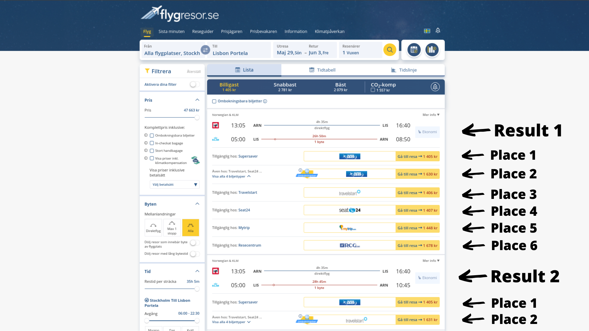

# Stream UI Documentation  

## Position 

The filter "OTA(s) to show" diplays the selected OTAs position in search packets. 

10 results are displayed in every search packet, and when the user scrolls down far enough 10 more are loaded and sent as a separate packet. 

Every result has multiple agents, which are the different brands competing through price for the same flight. In the UI the selected OTAs' highest ranked flight result and its agent's relative place is displayed. 
